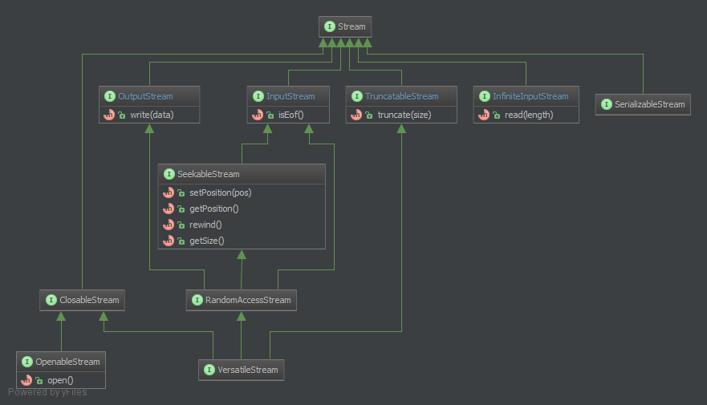

php-streams
===========

<div style="background-color: red; color: white; font-weight: bold; padding: 10px; margin-top: 10px;">This library is work-in-progress.</div>

This is a common and framework-agnostic set of stream-interfaces. The target is to supply an abstraction-layer for stream-providers as well as stream-consumers. There is documentation for the usage and the expected behaviour. Meaningful exceptions and compliance-tests are also included.


Streams
-------

Streams are useful to read and write string-based data from resources. Resources can be everything that is able to emit or consume a stream of characters:

* Devices
* Files
* Networks
* Pipes
* Virtual resources
* Converters
* etc

Thanks to abstraction, an application, service, or framework could rely an appropriate interface and is henceforth aware of byte-streams of any form.

The interfaces are built with the SOLID-principles in mind, especially the [interface-segregation-principle](http://en.wikipedia.org/wiki/Interface_segregation_principle).

Every interface should only implement the absolute necessary methods required to target an (possible) existing type of stream.

Every stream implementation should only be forced to implement essential functionality.

Every IoC-aware component should only depend on interfaces, which provide the required functionality.

A logger for example only need to depend on a OutputStream. The logger do not need to know about the stream-size or the current cursor-position. A logger should not be aware of log-file-rotation or disk-space-monitoring. This should be a concern of an outer component. So the logger could write to any writable stream without having a clue, what kind of stream this actually is.


Charsets and data-types
-----------------------

Streams are principally charset agnostic. It's a concern of the respective implementation and its documentation how the incoming and outgoing data is treated. The (upcoming) standard-implementation of this library will provide plain 8-bit access to the supported resources.

It is totally valid to build stream-implementations, that read data from other 8-bit-stream-implementations and convert them inplace. This applies to any form of direct conversion (charsets; en- or decoding; en- or decryption; security scanning; manipulation; etc).


Overview
--------




### Stream

`Stream` is the base-class for a number of other classes. Its main purpose is to provide functionality to connect or disconnect to a stream and give a base type for type-hinting:

```PHP
function handleStream(Stream $stream) {
	if($stream instanceof OutputStream) {
		// ...
	}
	if($stream instanceof InputStream) {
		// ...
	}
	throw new Exception('Unsupported stream type');
}
```

Method | Return-type | Possible exception(s)
------ | ----------- | ---------------------
`connect()` | `static` | ResourceLockedException, IOException
`disconnect()` | `static` | IOException


### InfiniteInputStream

An `InfiniteInputStream` is a read-only stream that has no end. The `InputStream` is good for situations were it doesn't matter if a `Stream` has other abilities then reading data. It does not ship methods to open or close a stream.

Examples:

* Virtual resources
  * [(linux) /dev/random](http://en.wikipedia.org/wiki//dev/random)
  * [(linux) /dev/null](http://en.wikipedia.org/wiki//dev/null)


### InputStream

An `InputStream` is a read-only stream that has an end. The `InputStream` is good for situations were it doesn't matter if a `Stream` has other abilities then reading data and closing the stream.

The `InputStream` publish these methods:

Method | Return-type | Possible exception(s)
------ | ----------- | ---------------------
`read($length = null)` | `string` | IOException
`isAtEnd()` | `bool` | -

* `read`: Reads `$length` bytes from the current position. If the current position plus `$length` exceeds the end of stream, the actual content will contain only the remaining bytes till the end of the stream and the cursor gets placed there.
* `isAtEnd`: If `true` the end of the stream was reached with either a read- or seek-operation. This method must not throw an exception.

Examples:

* Pipe
  * [STDIN](http://en.wikipedia.org/wiki/Standard_streams#Standard_input_.28stdin.29)
* Files
* Networkstreams


### OutputStream

An `OutputStream` is a write-only stream. It has no information on its size or the cursor-position in the stream. The `OutputStream` is good for situations were it doesn't matter if a `Stream` has other abilities then writing data and closing the stream.

Method | Return-type | Possible exception(s)
------ | ----------- | ---------------------
`write($data)` | `static` | IOException

Examples:

* Pipe
  * [STDOUT](http://en.wikipedia.org/wiki/Standard_streams#Standard_output_.28stdout.29)
  * [STDERR](http://en.wikipedia.org/wiki/Standard_streams#Standard_error_.28stderr.29)
* Files
* Networkstreams


### TruncatableStream

TODO

Method | Return-type | Possible exception(s)
------ | ----------- | ---------------------
`truncate($size = 0)` | `static` | IOException


### SeekableStream

Method | Return-type | Possible exception(s)
------ | ----------- | ---------------------
`getSize()` | `int` | IOException
`getPosition()` | `int` | IOException
`setPosition($pos)` | `static` | IOException
`rewind()` | `static` | IOException


### RandomAccessStream

The `VersatileStream` applies to fully accessible resources like local files. It extends `InputStream`, `OutputStream` and `SeekableStream`. This interface should likly be used for read-, writable- and seekable resources.

Examples:

* Local files
* Network files (ftp, sftp, etc)
* I/O-Converters (plain-to-base64 and vice-versa, en- and decryption, etc)