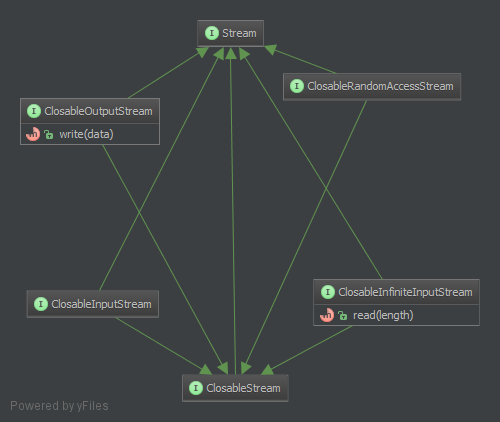

php-streams
===========

This is a framework-agnostic set of byte-streams to abstract the support for streams in PHP. There is documentation on the expected behaviour. Exceptions and compliance-tests are also included.

Streams
-------

Byte-streams are useful to read and write byte-based data from resources. Those resources can be everything that is able to emit or consume a stream of bytes:

- Devices
- Files
- Networks
- Pipes
- Virtual resources
- etc

Through abstraction an application, service or framework could rely a appropriate interface and is henceforth aware of byte-streams of any form.

The interfaces are built with the SOLID-principles in mind, especially the [interface-segregation-principle](http://en.wikipedia.org/wiki/Interface_segregation_principle).

Every interface should only implement the absolute necessary methods required to target an (possible) existing type of stream.

Every stream implementation should only be forced to implement applicable functionality.

Every IoC-aware component should only depend on interfaces, which are provide the required functionality.

A logger for example only need to depend on a OutputStream. The logger do not need to open or close the stream nor does it need to know about the stream-size or the current cursor-position. A logger should not be aware of log-file-rotation or disk-space-monitoring. This is done by an outer component. So the logger could write to any writable stream without ay clue, what kind of stream this exactly is.


Overview
--------


### Stream

The `Stream` is the base-class for a number of other classes. Its mail purpose is to give a base type for type-hinting:

```PHP
function handleStream(Stream $stream) {
	if($stream instanceof OutputStream) {
		// ...
	}
	if($stream instanceof InputStream) {
		// ...
	}
	throw new Exception('Unsupported stream type');
}
```

### ClosableStream

A `ClosableStream` can be detached from an resource. An IoC-aware component may not enforce this interface if closing a stream could lead to unexpected behaviour in the outer program.




### InfiniteInputStream

An `InfiniteInputStream` is a read-only stream that has no end. The `InputStream` is good for situations were it doesn't matter if a `Stream` has other abilities then reading data. It does not ship methods to open or close a stream.

Examples:

* Virtual resources
  * [(linux) /dev/random](http://en.wikipedia.org/wiki//dev/random)
  * [(linux) /dev/null](http://en.wikipedia.org/wiki//dev/null)


### InputStream

An `InputStream` is a read-only stream that has an end. The `InputStream` is good for situations were it doesn't matter if a `Stream` has other abilities then reading data and closing the stream.

Examples:

* Pipe
  * [STDIN](http://en.wikipedia.org/wiki/Standard_streams#Standard_input_.28stdin.29)
* Files
* Networkstreams


### OutputStream

An `OutputStream` is a write-only stream. It has no information on its size or the cursor-position in the stream. The `OutputStream` is good for situations were it doesn't matter if a `Stream` has other abilities then writing data and closing the stream.

Examples:

* Pipe
  * [STDOUT](http://en.wikipedia.org/wiki/Standard_streams#Standard_output_.28stdout.29)
  * [STDERR](http://en.wikipedia.org/wiki/Standard_streams#Standard_error_.28stderr.29)
* Files
* Networkstreams


### OpenableStream

TODO


### TruncatableStream

TODO


### SeekableStream

TODO


### RandomAccessStream

TODO


### VersatileStream

TODO
