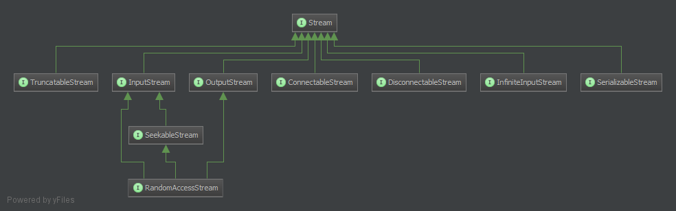

php-streams
===========

This is a common and framework-agnostic set of byte-stream-interfaces. The target is to supply an abstraction-layer for stream-providers as well as stream-consumers. There is documentation for the usage and the expected behaviour. Meaningful exceptions and compliance-tests are also included.


Streams
-------

Byte-streams are useful to read and write byte-based data from resources. Resources can be everything that is able to emit or consume a stream of bytes:

- Devices
- Files
- Networks
- Pipes
- Virtual resources
- etc

Thanks to abstraction, an application, service, or framework could rely an appropriate interface and is henceforth aware of byte-streams of any form.

The interfaces are built with the SOLID-principles in mind, especially the [interface-segregation-principle](http://en.wikipedia.org/wiki/Interface_segregation_principle).

Every interface should only implement the absolute necessary methods required to target an (possible) existing type of stream.

Every stream implementation should only be forced to implement essential functionality.

Every IoC-aware component should only depend on interfaces, which provide the required functionality.

A logger for example only need to depend on a OutputStream. The logger do not need to open or close the stream, nor does it need to know about the stream-size or the current cursor-position. A logger should not be aware of log-file-rotation or disk-space-monitoring. This should be a concern of an outer component. So the logger could write to any writable stream without having a clue, what kind of stream this actually is.


Charset and
---

The data is principally charset agnostic and the implementation should treat the input always as a stream of 8-bit characters. Charset-conversion is not a direct concern of a stream. The output of a stream could be converted (whenever it is actually a hex, base64 or utf8 stream) by domain-logic, which in turn could insert the output into another byte-stream. This could be done by a wrapping stream. Here is an non-functioning concept code example:


```PHP
$inputStream = new Std\ResourceInputStream(STDIN);
$base64Stream = new App\BufferedBase64ConvertStream($inputStream);
new Std\StdOutputStream($base64Stream);
```

Please note


Overview
--------




### Stream

`Stream` is the base-class for a number of other classes. Its main purpose is to give a base type for type-hinting:

```PHP
function handleStream(Stream $stream) {
	if($stream instanceof OutputStream) {
		// ...
	}
	if($stream instanceof InputStream) {
		// ...
	}
	throw new Exception('Unsupported stream type');
}
```

### ClosableStream


A `ClosableStream` is a stream which can be detached from an resource. An IoC-aware component may not enforce this interface in case of closing a stream could lead to unexpected behaviour in the outer program.

*If a component does not really need to close a stream, then dont use this interface or any descendant of it.*


### InfiniteInputStream

An `InfiniteInputStream` is a read-only stream that has no end. The `InputStream` is good for situations were it doesn't matter if a `Stream` has other abilities then reading data. It does not ship methods to open or close a stream.

Examples:

* Virtual resources
  * [(linux) /dev/random](http://en.wikipedia.org/wiki//dev/random)
  * [(linux) /dev/null](http://en.wikipedia.org/wiki//dev/null)


### InputStream

An `InputStream` is a read-only stream that has an end. The `InputStream` is good for situations were it doesn't matter if a `Stream` has other abilities then reading data and closing the stream.

The `InputStream` publish these methods:

* `read($length = null): string`<br />read `$length` bytes from the current position. If the current position plus `$length` exceeds the end of stream, the actual content will contain only the remaining bytes till the end of the stream and the cursor gets placed there.
* `isAtEnd(): bool`

Examples:

* Pipe
  * [STDIN](http://en.wikipedia.org/wiki/Standard_streams#Standard_input_.28stdin.29)
* Files
* Networkstreams


### OutputStream

An `OutputStream` is a write-only stream. It has no information on its size or the cursor-position in the stream. The `OutputStream` is good for situations were it doesn't matter if a `Stream` has other abilities then writing data and closing the stream.

Examples:

* Pipe
  * [STDOUT](http://en.wikipedia.org/wiki/Standard_streams#Standard_output_.28stdout.29)
  * [STDERR](http://en.wikipedia.org/wiki/Standard_streams#Standard_error_.28stderr.29)
* Files
* Networkstreams


### OpenableStream

TODO


### TruncatableStream

TODO


### SeekableStream

TODO


### RandomAccessStream

TODO


### VersatileStream

TODO
